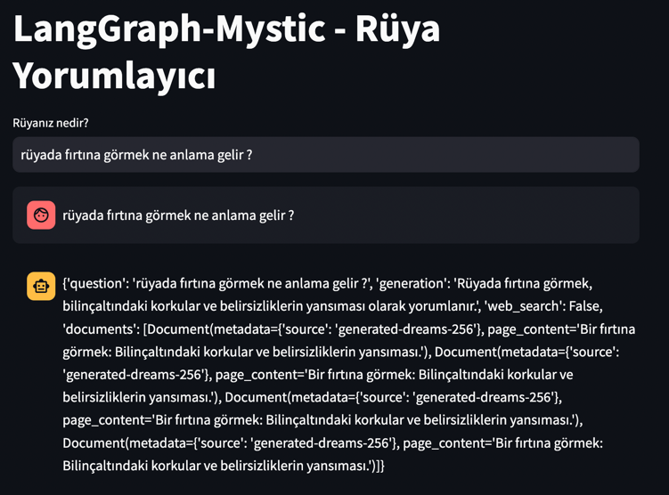

# LangGraph Mystic 🔮 




**langchain-mystic** is an advanced mystical bot built using LangChain. This bot specializes in dream interpretation, leveraging LangChain's powerful capabilities to provide deeper insights and more refined predictions.

## Features

- **Dream Interpretation:** Enhanced dream interpretation using LangChain's advanced capabilities.

## Installation

To set up the project locally, follow these steps:

1. **Clone the repository:**
    ```bash
    git clone https://github.com/username/langgraph-mystic.git
    ```

2. **Navigate to the project directory:**
    ```bash
    cd mystic
    ```

3. **Install the necessary dependencies:**
    ```bash
    pip install -r requirements.txt
    ```

4. **Run the application:**
    ```bash
    streamlit run streamlit_app.py
    ```

## Usage

Once the project is running, you can interact with the bot to get dream interpretations and fortune-telling readings. The LangChain-powered bot provides advanced insights and predictions.

### Example Commands

- **Dream Interpretation:**
    ```bash
    /dream I had a dream about flying.
    ```

- **Fortune-Telling:**
    ```bash
    /fortune Tell me about my future in love.
    ```
## Libraries Used

- `beautifulsoup4`
- `langchain`
- `langgraph`
- `langchainhub`
- `langchain-community`
- `tavily-python`
- `langchain-chroma`
- `python-dotenv  `
- `pytest`
- `langchain-openai`
- `altair`
- `streamlit`

## Graph


## Contributing

We welcome contributions to further enhance the bot's capabilities. If you have ideas for new features or improvements, please submit a pull request. This project is open-source, and contributions are encouraged.

### Contribution Guidelines

- Open an issue to discuss potential features before implementing them.
- Follow the project's coding style and standards.
- Submit detailed pull requests with explanations.

## License

This project is licensed under the [MIT License](LICENSE).

---

**langchain-mystic:** Dive deeper into the magic with LangChain's advanced capabilities. 🌙🔮
